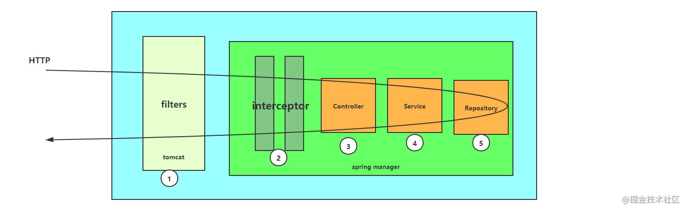
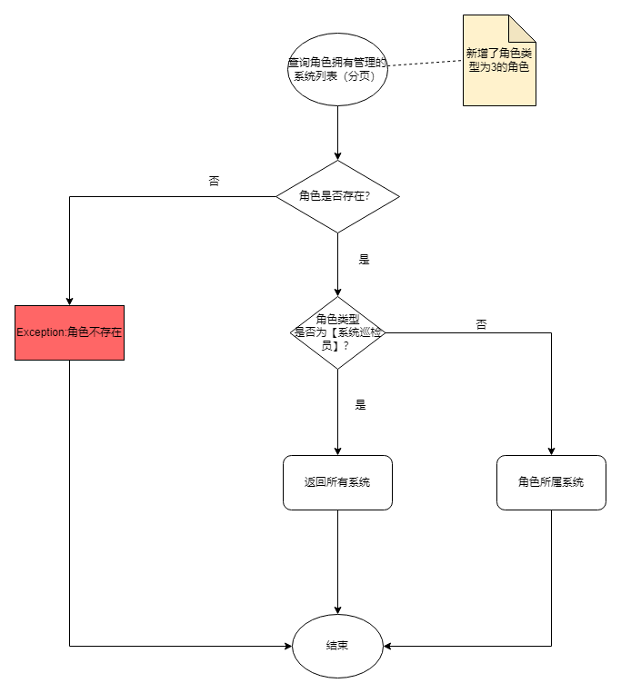
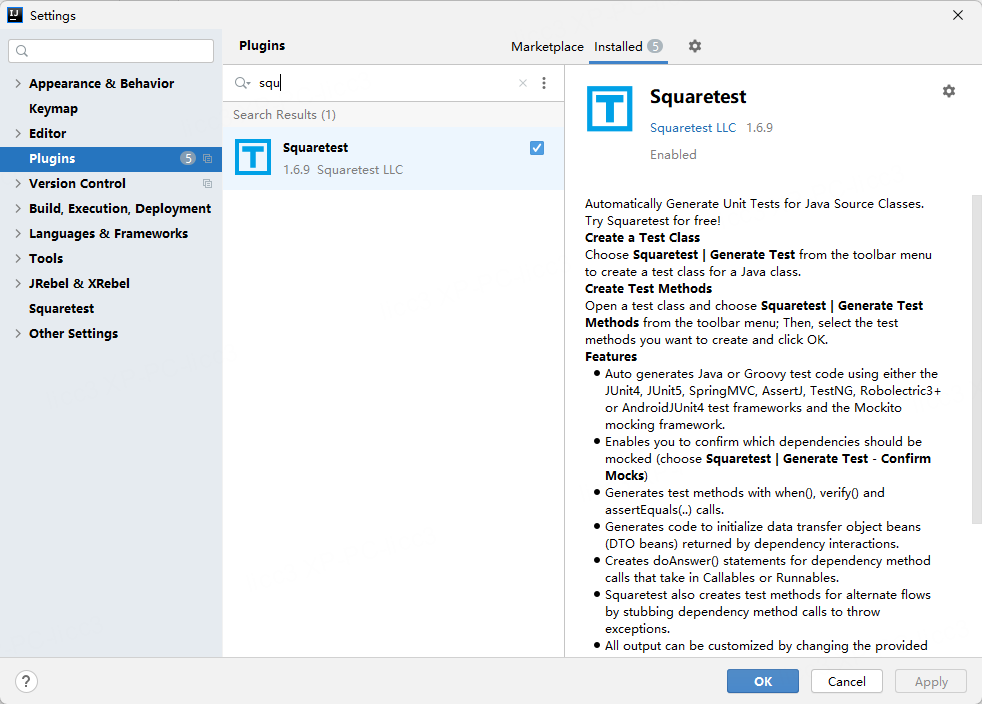
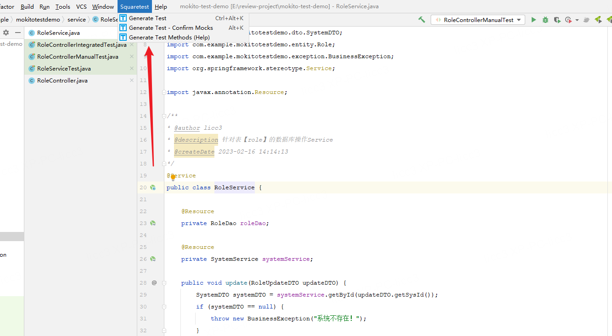
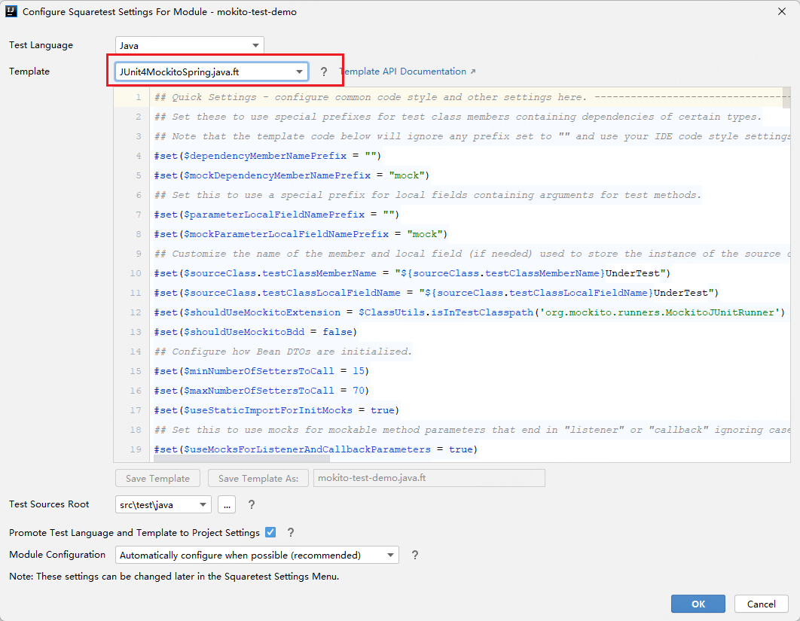
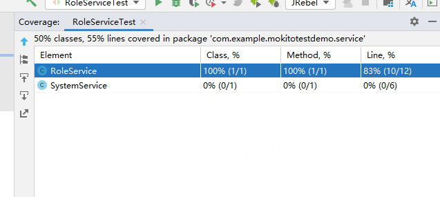
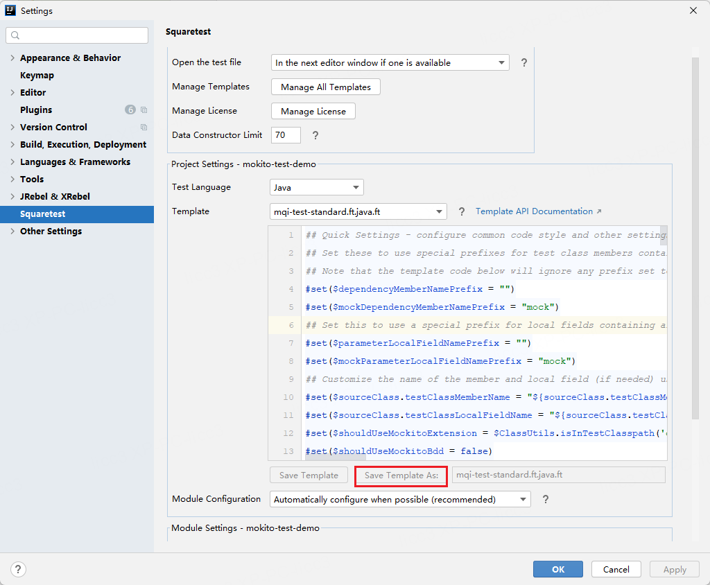

# 如何规范编写单元测试

## 写在前面

        本文通过实际项目单元测试经验，整理了可以支持三种场景——独立单侧，多个单测集成，静态方法最终方法的规范编写。同时根据模板生成软件，生成规范代码，减少单测开发成本，达到最大收益。

        由于单测的场景比较单一，只是普通业务功能场景，如果涉及认证授权等依赖其他框架的单测，一下场景不一定通用，读者需根据自身场景使用。


## 1. 目标和原则

### 1.1 目标

        单元测试是编写测试代码，用来检测**特定的、明确的、细颗粒**的功能。单元测试并不一定保证所有程序功能是正确的，但是却能最大程度上保证系统的核心逻辑稳定，不至于出现阻断性错误。单元测试不仅仅用来保证当前代码的正确性，更重要的是用来保证代码**修复**、**改进**或**重构**之后的正确性。

**解析：**

        从特定的，明确的，细颗粒这三方面更好的诠释了何谓“单元”，单元测试是不同于集成测试的，通常来说，单元测试是对一个函数（方法）进行功能正确性的测试，任何需要依赖两个函数的测试都不能称之为“单元”。虽然单元测试不能一定保证函数是正确的，因为实际的运行场景是复杂的，但是能保证自己编写的主要的逻辑正确性，不至于导致阻断性的问题产生。

        例如在编写controller的单测中，测试该接口的请求协议，入参和出参，防止改动之后不能向下兼容的情况发生，而不是直接controller，service, dao贯穿测试，否则，单测当出现问题时，增加了不必要的排查时间。

        因此单测在项目迭代中，面对修复，改进和重构之后，对整个系统的稳定性能提供很大的帮助。

### 1.2 基本原则

- 【强制】好的单元测试必须遵守AIR原则。

说明：单元测试在线上运行时，感觉像空气（AIR）一样并不存在，但在测试质量的保障上，却是非常关键的。好的单元测试宏观上来说，具有自动化、独立性、可重复执行的特点。

        - A：Automatic（自动化）

  说明：单元测试应该是全自动执行的，不需要人为的干预（非交互式），输出的结果不需要人工检查的。单元测试中不允许使用System.out.print来进行人肉验证，**必须使用assert来验证。** 这样在部署项目的时候，便能抛出异常终止运行，不影响已部署的系统。

        - I：Independent（独立性）

  说明：单元测试之间不能互相调用，也不能依赖执行的先后次序（通常需要依赖的接口方法用mock来模拟，避免真实依赖）。——消除**内部依赖**，即是面向单一函数（方法）的测试。

        - R：Repeatable（可重复）

  说明：可重复执行的主要要求就是单元测试不能依赖外部环境，比如网络、服务、中间件等（通常需要依赖的接口方法用mock来模拟，避免真实依赖）。——消除**外部依赖**。例如在我们系统体系中，单测不依赖于Nacos和数据库环境。


- 【强制】对于单元测试，要保证测试粒度足够小，有助于精确定位问题。单测粒度至多是类级别，一般是方法级别。
  
    说明：只有测试粒度小才能在出错时尽快定位到出错位置。单测不负责检查跨类或者跨系统的交互逻辑，那是集成测试的领域。
  
  

- 【强制】核心业务、核心应用、核心模块的增量代码确保单元测试通过。
  
    说明：新增代码及时补充单元测试，如果新增代码影响了原有单元测试，请及时修正。这里的影响一般来说是两个方面造成的，一是改了原有代码，二是原有代码的数据依赖新增代码。

- 【强制】单元测试代码必须写在如下工程目录：src/test/java，不允许写在业务代码目录下。
  
    说明：源码构建时会跳过此目录，而单元测试框架默认是扫描此目录。
  
  

- 【强制】单测方法用例必须包含测试方法名称，以test开头，不同用例用下划线区分（Junit规范）。

```java
    // 测试目标方法名getById
    // 成功用例
    @Test
    public SystemDTO testGetById_Success() {

    }
    // 返回null用例
    @Test
    public SystemDTO testGetById_ReturnNUll() {
    }
```


- 【推荐】单元测试类方法需要添加java doc `{@link}`注释，指向已经编写过的单测用例。

说明：方便方法改动后，开发人员快速定位单元测试

```java
public class SystemService {
    @Resource
    private SystemDao systemDao;

    @Resource
    private SystemMapper systemMapper;

    /**
     * testCase:
     * {@link com.example.mokitotestdemo.service.SystemServiceTest#testGetById}
     * {@link com.example.mokitotestdemo.service.SystemServiceTest#testGetById_withNull}
     * @param sysId
     * @return
     */
    public SystemDTO getById(Long sysId) {
        if (sysId == null) {
            return null;
        }
        System system = systemDao.getById(sysId);
        if (system == null) {
            return null;
        }
        return BeanUtil.copyProperties(system, SystemDTO.class);
    }

}
```


- 【推荐】编写单元测试代码遵守BCDE原则，以保证被测试模块的交付质量。
  
  - B：Border，边界值测试，包括循环边界、特殊取值、特殊时间点、数据顺序等。
  
  - C：Correct，正确的输入，并得到预期的结果。
  
  - D：Design，与设计文档相结合，来编写单元测试。
  
  - E：Error，强制错误信息输入（如：非法数据、异常流程、非业务允许输入等），并得到预期的结果。


- 【推荐】对于数据库相关的查询，更新，删除等操作，不能假设数据库里的数据是存在的，或者直接操作数据库把数据插入进去，请使用程序插入或者导入数据的方式来准备数据。
  
  <u>  反例：删除某一行数据的单元测试，在数据库中，先直接手动增加一行作为删除目标，但是这一行新增数据并不符合业务插入规则，导致测试结果异常。</u>
  
  

- 【推荐】和数据库相关的单元测试，可以设定自动回滚机制，不给数据库造成脏数据。或者对单元测试产生的数据有明确的前后缀标识。
  
    正例：在RDC内部单元测试中，使用RDC_UNIT_TEST_的前缀标识数据。

<u>由于复杂的业务场景，依赖真实环境的数据库进行DAO层的单测总会出现脏数据，数据变更导致单测断言失败问题，所以建议使用H2这种内存数据库，在每次执行单测初始化数据。</u>


- 【推荐】对于不可测的代码建议做必要的重构，使代码变得可测，避免为了达到测试要求而书写不规范测试代码。


- 【推荐】在设计评审阶段，开发人员需要和测试人员一起确定单元测试范围，单元测试最好覆盖所有测试用例。


- 【推荐】单元测试作为一种质量保障手段，不建议项目发布后补充单元测试用例，建议在项目提测前完成单元测试。


## 2. 规范的编写

### 2.1 概述

  一般来说，我们的编写后端逻辑分为三层，Controller -> Service -> Repository（Dao），所以在对我们的项目进行单测的编写的时候，也是按照这层逻辑编写的。下面是一般的接口请求图：



在规范的单元测试当中，如果我们想要对controller层进行单测，那么我们应该去除service、interceptor和filters层依赖，也就是说不管service的逻辑怎样，是否存在错误，都不是controller所要关心的。当然，需不需要经过filters和interceptor，由自己的单测目标决定(例如有些接口权限在interceptor层控制，需要配合controller进行集成测试)。

下面的单元测试案例中，统一使用Junit4+PowerMockito和Mockito框架，并不对用法进行展开描述，只对不同测试对象，测试场景进行规范约束。有关PowerMockito和Mockito的用法，请自行参考相关文档。


### 2.2 maven依赖

- 【强制】使用基于Junit4的单元测试框架。

说明：使用Junit5可能会有Mockito不兼容的问题，未进行可行性验证。

```xml
<dependency>
    <groupId>org.springframework.boot</groupId>
    <artifactId>spring-boot-starter-test</artifactId>
    <scope>test</scope>
</dependency>
<dependency>
    <groupId>org.powermock</groupId>
    <artifactId>powermock-module-junit4</artifactId>
    <version>2.0.9</version>
    <scope>test</scope>
</dependency>
<dependency>
    <groupId>org.powermock</groupId>
    <artifactId>powermock-api-mockito2</artifactId>
    <version>2.0.9</version>
    <scope>test</scope>
</dependency>
```


### 2.3 controller单测规范

#### 2.3.1 目标

在Spring MVC的控制层设计初衷：处理由DispatcherServlet 分发的请求，它把用户请求的数据经过业务处理层处理之后封装成一个Model ，然后再把该Model 返回给对应的View 进行展示。

所以controller单测的目标就是能**正确接收请求，返回处理后的数据**。


#### 2.3.2 原则

- 【强制】不能编写Controller->Dao的贯穿测试，那不属于单元测试的范畴。

反例：

```java
@AutoConfigureMockMvc
// 使用真实springBoot环境
@SpringBootTest(webEnvironment = SpringBootTest.WebEnvironment.RANDOM_PORT)
public class RoleControllerTest {
    // 注入真实对象
    @Resource
    private WebApplicationContext webApplicationContext;

    @PostConstruct
    private void setMockMvc() {
        this.mockMvc = MockMvcBuilders.webAppContextSetup(
                webApplicationContext).build();
    }

    @Test
    public void test() {
        final RoleUpdateDTO updateDTO = new RoleUpdateDTO();
        updateDTO.setId(1L);
        updateDTO.setRoleCode("roleCode");
        updateDTO.setRoleName("roleName");
        updateDTO.setSysId(1L);
        // 下面的操作，会直接请求真实的数据
        MvcResult mvcResult = this.mockMvc.perform(MockMvcRequestBuilders.post("/update")
                .contentType(MediaType.APPLICATION_JSON).content(JSONObject.toJSONString(updateDTO )).andReturn();
        mvcResult.getResponse().setContentType("content-type text/plain;charset=utf-8");
        if(200 != mvcResult.getResponse().getStatus()){
            log.info("测试结果异常信息:"+mvcResult.getResponse().getErrorMessage());
        }else{
            log.info("测试结果信息:"+mvcResult.getResponse().getContentAsString());
        }
    }
}
```


- 【强制】测试类使用注解`@RunWith(MockitoJUnitRunner.class)`修饰，保证mockMvc生效。


- 【强制】依赖成员使用`@Mock`修饰，表示去除依赖。


- 【强制】测试目标Controller成员使用`@InjectMocks`修饰，并在`@Before`修饰的方法中，使用`this.mockMvc = MockMvcBuilders.`*`standaloneSetup`*`(xxxController).build()` 初始化mockMvc。

说明：@InjectMocks修饰的成员表示主体，Mockito会将所有@Mock修饰的成员注入（Inject）到该成员当中。


- 【强制】验证返回结果，必须断言期望返回状态码。推荐使用mockMvc自带的断言方式（参考下面代码示例）。


- 【推荐】对接口入参非空校验的字段，单独编写用例。


#### 2.3.3 代码示例

```java
//测试类的头, 使Mock生效
@RunWith(MockitoJUnitRunner.class)
public class RoleControllerManualTest {
    private MockMvc mockMvc;

    private String prefix;
    // mock代理依赖的类
    @Mock
    private RoleService mockRoleService;
    // 需要测试的类
    @InjectMocks
    private RoleController roleController;

    @Before
    public void setUp() {
        // 构造请求的模拟对象
        this.mockMvc = MockMvcBuilders.standaloneSetup(roleController).build();

        this.prefix = "/role";
    }

    /**
     * 测试用例：请求，入参，状态
     *
     * @throws Exception
     */
    @Test
    public void updateTest() throws Exception {
        // 模拟请求，构造参数，断言返回
    }
}
```

**编写用例**

- 请求成功用例

```java
/**
 * 测试用例：请求，入参，状态
 * 期望请求成功
 * @throws Exception
 */
@Test
public void updateTest() throws Exception {
    // 模拟请求参数
    final RoleUpdateDTO updateDTO = new RoleUpdateDTO();
    updateDTO.setId(1L);
    updateDTO.setRoleCode("roleCode");
    updateDTO.setRoleName("roleName");
    updateDTO.setSysId(1L);
    // mock依赖方法
    Mockito.doNothing().when(mockRoleService).update(any());
    // 模拟请求
    MockHttpServletRequestBuilder requestBuilder = MockMvcRequestBuilders.post(this.prefix + "/update").contentType(
            MediaType.APPLICATION_JSON).content(JSONObject.toJSONString(updateDTO));
    // mockMvc判断http状态码
    mockMvc.perform(requestBuilder).andExpect(status().isOk()).andReturn();
}
```

- 请求失败用例

```java
/**
 * 期望返回参数为空异常
 * @throws Exception
 */
@Test
public void updateTestValidate() throws Exception {
    final RoleUpdateDTO updateDTO = new RoleUpdateDTO();
    // 设置未null，检查valid是否生效
    updateDTO.setId(null);
    updateDTO.setRoleCode("roleCode");
    updateDTO.setRoleName("roleName");
    updateDTO.setSysId(1L);
    // mock依赖方法
    Mockito.doNothing().when(mockRoleService).update(any());
    // 模拟请求
    MockHttpServletRequestBuilder requestBuilder = MockMvcRequestBuilders.post(this.prefix + "/update").contentType(
            MediaType.APPLICATION_JSON).content(JSONObject.toJSONString(updateDTO));
    // 判断http状态码400
    MvcResult mvcResult = mockMvc.perform(requestBuilder).andExpect(status().is(400)).andReturn();
    Exception resolvedException = mvcResult.getResolvedException();
    // 这里没有经过统一异常处理和统一返回包装，所以抛出的错误在此处断言
    assert resolvedException instanceof MethodArgumentNotValidException;

}
```


#### 2.3.4 总结

        controller的单测主要目标是防止**接口定义，入参校验，错误提示**被更改。从上面的例子中可以看到，执行过程中并没有通过【统一异常处理】和【统一返回包装】，这是因为这种测试方式，并没有启动springBoot，所以相关的框架并没有生效。如果要生效，则需要使用集成测试。

相关注解：

@RunWith(SpringRunner.class)

@SpringBootTest(webEnvironment = SpringBootTest.WebEnvironment.*RANDOM_PORT*)


### 2.4 service单测规范

#### 2.4.1 目标

        service作为我们后端开发中主要的逻辑处理层，里面的函数是最为复杂的，除了按照上面的方法消除其依赖的类，对入参进行**严谨的数据构造**之外，还要对依赖的类调用进行mock返回值构造，这样才能应对复杂的逻辑，得到函数（方法）期待返回的结果。因为一个service的方法返回有多种情况（在方法体内有多个分支判断，异常抛出），所以从理论上，**我们对这样的函数都要做到分支、异常结果断言覆盖。**


#### 2.4.2 原则

- 【强制】必须覆盖主要功能的测试用例，保证阻断性问题提前发现。


- 【强制】所有需要测试的类必须保证使用注解`@RunWith(PowerMockRunner.class)` `@PowerMockRunnerDelegate(SpringRunner.class)`修饰。

说明：经验证，使用这两个注解可以满足普通单元测试，多个单元集成测试，私有、静态和最终的方法测试。


- 【强制】测试的目标成员使用`@InjectMocks`修饰，依赖的成员使用`@Spy`修饰。

说明：@InjectMocks可以注入那些被@Spy修饰的成员（依赖）。


- 【强制】`@RunWith(PowerMockRunner.class)`修饰的单测，需要@Before方法中，显示调用`MockitoAnnotations.`*`initMocks(this)`**来使得Mockito相关功能生效。*


- 【强制】需要集成单元的所属依赖类，必须同时使用`@Spy`和`@InjectMocks`注解修饰。

例如，RoleService依赖SystemService，RoleDao，并需要对前两个集成测试，此时，SystemService需要同时被

@Spy和@InjectMocks修饰。

```java
@RunWith(PowerMockRunner.class)
@PowerMockRunnerDelegate(SpringRunner.class)
public class RoleServiceTest {

    // 测试目标对象
    @InjectMocks
    private RoleService roleServiceTest;
    // SystemService依赖对象
    @Spy
    private SystemDao mockSystemDao;
    // 依赖对象
    @Spy
    @InjectMocks
    private SystemService mockSystemService;
    // 依赖对象
    @Spy
    private RoleDao mockRoleDao;

}
```


- 【强制】不要在单独在catch里面断言错误类型和提示语，防止捕获失败断言失效。如果要断言异常，请搭配`@Test(expected = XXXException.class)`使用。

```java
// 断言异常类型
@Test(expected = BusinessException.class)
public void testUpdate_SystemServiceReturnsNull() {
    // Setup
    final RoleUpdateDTO updateDTO = new RoleUpdateDTO();
    updateDTO.setId(0L);
    updateDTO.setRoleCode("roleCode");
    updateDTO.setRoleName("roleName");
    updateDTO.setSysId(0L);
    // 系统查询返回为空，报错
    doReturn(null).when(mockSystemService).getById(any());

    // Run the test
    try {
        roleServiceUnderTest.update(updateDTO);
    } catch (BusinessException e) {
        // 既校验了错误类型，也校验了提示语
        assertEquals("系统不存在！", e.getMessage());
        // 再次抛出
        throw e;
    }
}
```


- 【推荐】定义公共父类BaseTest，并用`@RunWith(PowerMockRunner.class)`和 `@PowerMockRunnerDelegate(SpringRunner.class)`修饰。


- 【推荐】所有成员放入BaseTest，并用`@Spy`和`@InjectMocks`注解修饰；测试类中单独定义测试目标成员，并使用`@InjectMocks`修饰。

说明：这样做的好处可以提高20%的启动速度，保持单元测试类简洁，弊端是需要频繁管理BaseTest的成员。

如对上面例子的改造：

```java
@RunWith(PowerMockRunner.class)
@PowerMockRunnerDelegate(SpringRunner.class)
public class BaseTest{

    // 出现的bean全部使用下面注解修饰
    @Spy
    @InjectMocks
    private RoleService roleServiceTest;

    @Spy
    @InjectMocks
    private SystemDao mockSystemDao;

    @Spy
    @InjectMocks
    private SystemService mockSystemService;

    @Spy
    @InjectMocks
    private RoleDao mockRoleDao;
}

public class RoleServiceTest extends BaseTest{
    // 测试目标对象
    @InjectMocks
    private RoleService roleServiceTest;
}
```

<font color=red>注意：Mapper，Feign这些接口类不能使用@InjectMocks注解。</font>


- 【推荐】基本对象初始化在BaseTest中定义，再根据不同用例对字段单独赋值。

说明：屏蔽无关代码，保持测试类的简洁，增强代码复用。

```java
@Test
public void testSubmitDeliveryOrder() {
    // DeliveryOrder初始化交给父类
    DeliveryOrder order = super.buildDeliveryOrder();
    // 对本用例有关的参数单独赋值
    // 未完成
    order.setStatus(0);
    // 未关闭
    order.setCloseStatus(0);

    // do other...

}
```


#### 2.4.3 代码示例

        如果真的要做到全分支、异常结果的覆盖，这样的单测所要花费的时间实际上是比开发时间还要长的。一般来说，我们只要对service函数主要功能进行单元测试便可，一来可以节省开发时间，二来也是能能保证主要功能快速排查纠错，达到最大的收益。

**service功能逻辑**

```java
public void update(RoleUpdateDTO updateDTO) {
    SystemDTO systemDTO = systemService.getById(updateDTO.getSysId());
    if (systemDTO == null) {
        throw new BusinessException("系统不存在！");
    }

    RoleDTO codeRole = roleDao.getByCode(updateDTO.getRoleCode(), updateDTO.getSysId());
    if (codeRole != null && !codeRole.getId().equals(updateDTO.getId())) {
        throw new BusinessException("角色编码已存在" + codeRole.getRoleCode());
    }

    RoleDTO nameRole = roleDao.getByName(updateDTO.getRoleName(), updateDTO.getSysId());
    if (nameRole != null && !nameRole.getId().equals(updateDTO.getId())) {
        throw new BusinessException("角色名称已存在" + nameRole.getRoleName());
    }

    roleDao.updateById(BeanUtil.copyProperties(updateDTO, Role.class));
}
```


**单元测试用例**

共用BaseTest:

```java
/**
 * 公用父类，供单元测试类实现
 * 需要依赖的bean统一定义在父类属性中
 */
@RunWith(PowerMockRunner.class)
public class BaseTest {
    // @Spy注解表示这个类会注入到@InjectMocks，默认调用真正的方法
    // 统一规范，除了Feign，Mapper不需要@InjectMocks注解
    // BaseTest中的所有属性都需要加上@Spy和@InjectMocks注解
    @Spy
    @InjectMocks
    protected RoleDao mockRoleDao;
    @Spy
    @InjectMocks
    protected SystemService mockSystemService;

}
```

```java
// 继承BaseTest
public class RoleServiceTest extends BaseTest{

    // 单测目标类通过@InjectMocks定义在本类中，其他依赖类，定义在BaseTest中
    @InjectMocks
    private RoleService roleServiceUnderTest;

    @Before
    public void setUp() {
    // 由于使用的是PowerMock,需要显示调用这个方法，使得Mockito生效
        initMocks(this);
    }

    @Test
    public void testUpdate() {
        // 构造目标方法入参
        final RoleUpdateDTO updateDTO = new RoleUpdateDTO();
        updateDTO.setId(0L);
        updateDTO.setRoleCode("roleCode");
        updateDTO.setRoleName("roleName");
        updateDTO.setSysId(0L);

        // 构造依赖方法返回值
        final SystemDTO systemDTO = new SystemDTO();
        systemDTO.setId(0L);
        systemDTO.setSysName("sysName");
        systemDTO.setSysCode("sysCode");

        // 构造数据库查询返回值
        final RoleDTO roleDTO = new RoleDTO();
        roleDTO.setId(0L);
        roleDTO.setRoleCode("roleCode");
        roleDTO.setRoleName("roleName");
        roleDTO.setSysId(0L);

        // 构造数据库查询返回值
        final RoleDTO roleDTO1 = new RoleDTO();
        roleDTO1.setId(0L);
        roleDTO1.setRoleCode("roleCode");
        roleDTO1.setRoleName("roleName");
        roleDTO1.setSysId(0L);
        // mock依赖方法返回结果
        doReturn(systemDTO).when(mockSystemService).getById(any());
        doReturn(roleDTO).when(mockRoleDao).getByCode(any(), any());
        doReturn(roleDTO1).when(mockRoleDao).getByName(any(), any());
        doReturn(false).when(mockRoleDao).updateById(any());

        // Run the test
        roleServiceUnderTest.update(updateDTO);

        // 验证方法执行次数是否满足期望
        verify(mockRoleDao, times(1)).updateById(any());
        verify(mockRoleDao, times(1)).getByCode("roleCode", 0L);
        verify(mockRoleDao, times(1)).getByName("roleName", 0L);
    }
}
```

同样的，需要对其他分支进行用例编写，保证功能稳定：

```java
@Test(expected = BusinessException.class)
public void testUpdate_SystemServiceReturnsNull() {
    // Setup
    final RoleUpdateDTO updateDTO = new RoleUpdateDTO();
    updateDTO.setId(0L);
    updateDTO.setRoleCode("roleCode");
    updateDTO.setRoleName("roleName");
    updateDTO.setSysId(0L);
    // 系统查询返回为空，报错
    doReturn(null).when(mockSystemService).getById(any());

    // Run the test
    try {
        roleServiceUnderTest.update(updateDTO);
    } catch (BusinessException e) {
        // 既校验了错误类型，也校验了提示语
        assertEquals("系统不存在！", e.getMessage());
        throw e;
    }
}
```

角色编码存在，不允许更新

```java
@Test
public void testUpdate_roleCodeExisted() {
    // Setup
    final RoleUpdateDTO updateDTO = new RoleUpdateDTO();
    updateDTO.setId(0L);
    updateDTO.setRoleCode("roleCode");
    updateDTO.setRoleName("roleName");
    updateDTO.setSysId(0L);

    // Configure SystemService.getById(...).
    final SystemDTO systemDTO = new SystemDTO();
    systemDTO.setId(0L);
    systemDTO.setSysName("sysName");
    systemDTO.setSysCode("sysCode");

    RoleDTO roleCodeEntity = new RoleDTO();
    roleCodeEntity.setId(1L);
    roleCodeEntity.setRoleCode("roleCode");
    roleCodeEntity.setRoleName("roleName");
    roleCodeEntity.setSysId(0L);


    doReturn(systemDTO).when(mockSystemService).getById(any());
    doReturn(roleCodeEntity).when(mockRoleDao).getByCode(any(), any());

    // Run the test
    try {
        roleServiceUnderTest.update(updateDTO);
    } catch (BusinessException e) {
        assertEquals("角色编码已存在" + roleCodeEntity.getRoleCode(), e.getMessage());
    }
}
```

**可以看到，一个规范的单元测试通常做了以下工作：**

- 消除依赖（也是通过controller示例中使用注解的方式）

- mock方法（doReturn().when().method())

- 构造数据（入参，依赖方法返回值）

- 结果断言(内容，函数执行次数，异常)

        但是在实际的项目开发中，我们需要单测的方法往往涉及很多对象变换，往往也涉及到很多**私有的、静态的、最终的方法**，这类单测实例参考PowerMockito的用法。

        其次，涉及到DAO层的单元测试，实际收益并不高，h2脚本和mysql脚本并不完全兼容，所以这里只附上相关链接，供大家参考：[Dao单元测试项目实战](https://mp.weixin.qq.com/s/zu8cS9JlGfNb2QrFuY1-HQ)


### 2.5 多个单元间的集成测试

#### 2.5.1 原则

- 【强制】集成单元的依赖成员必须使用`@Spy`和`@InjectMocks`修饰。


- 【强制】如果需要mock静态的，最终的方法，请在类或者对应方法上使用`@PrepareForTest(xxxObject.class)` 。


#### 2.5.2 demo流程图

        新单元的出现，可能影响到旧单元的功能，一个是代码层面改动造成的影响，另外一个是数据层面造成的失败。前者每个单元测试可以敏锐的捕获到（单测失败），而后者需要两个单元结合起来测试才能发现问题。下面通过一个简单的例子来说明。



功能代码：

```java
public Page<Role> managerRoles(Long roleId, Long size, Long page ) {
    Role role = roleDao.getById(roleId);
    if (role == null) {
        throw new BusinessException("角色不存在!");
    }
    // 获取角色可以管理的系统
    List<System> systems = systemService.managerSys(role);
    List<Long> sysIds = systems.stream().map(System::getId).collect(Collectors.toList());
    // 返回查询分页
    return roleDao.pageManagerRoles(size, page, sysIds);
}


public List<System> managerSys(Role role) {
    RoleType roleType = RoleType.valueOf(role.getRoleType());
    // 注意这段代码，如果新增了角色类型，则抛出错误
    if (roleType == null) {
        throw new BusinessException("没有找到对于的角色枚举类型,value=" + role.getRoleType());
    }
    if (RoleType.SYS_INSPECTION.equals(roleType)) {
        return systemDao.list();
    } else {
        return Arrays.asList(systemDao.getById(role.getSysId()));
    }
}
```

<font color=red>如果新的功能增加了角色类型，则在managerSys代码中，会抛出没有找到对于角色枚举类型的错误，从而影响了managerSys代码。下面对这两个单元(方法)进行集成测试。</font>


#### 2.5.3 用例编写

        首先定义BaseTest类，将测试目标单元依赖的bean定义到BaseTest中，**这样做的好处是，所有实现BaseTest的单元测试类都会初始化一次依赖关系，减少每个测试类单独启动时间。但需要额外花费时间管理这些成员冲突等问题。**

```java
/**
 * 公用父类，供单元测试类实现
 * 需要依赖的bean统一定义在父类属性中
 */
@RunWith(PowerMockRunner.class)
@PowerMockRunnerDelegate(SpringRunner.class)
public class BaseTest {
    // @Spy注解表示这个类会注入到@InjectMocks，默认调用真正的方法
    @Spy
    @InjectMocks
    protected RoleDao mockRoleDao;
    @Spy
    @InjectMocks
    protected SystemService mockSystemService;

}
```

之后编写目标单元测试类

```java
public class RoleServiceTest extends BaseTest{

    @InjectMocks
    private RoleService roleServiceUnderTest;

    @Before
    public void setUp() {
        initMocks(this);
    }
    /**
     * 多个单元的集成测试案例
     */
    @Test
    // 需要mock的静态类
    @PrepareForTest(BeanUtil.class)
    public void testUpdate_Integrate_roleTypeNotFound() {
        // 新增角色
        final Role addRole = new Role();
        addRole.setId(0L);
        addRole.setRoleCode("");
        addRole.setRoleName("");
        addRole.setRoleType(3);
        addRole.setSysId(0L);

        // 模拟静态方法返回值
        RoleDTO staticRoleDTO = new RoleDTO();
        staticRoleDTO.setId(0L);
        staticRoleDTO.setRoleCode("");
        staticRoleDTO.setRoleName("");
        staticRoleDTO.setSysId(0L);

        Long roleId = 1L;
        Long size = 10L;
        Long page = 1L;

        doReturn(true).when(mockRoleDao).save(any());
        doReturn(addRole).when(mockRoleDao).getById(1L);
        // 模拟静态类方法返回值
        PowerMockito.mockStatic(BeanUtil.class);
        PowerMockito.when(BeanUtil.toBean(addRole, RoleDTO.class)).thenReturn(staticRoleDTO);

        // Run the test
        roleServiceUnderTest.add(addRole);
        try {
            roleServiceUnderTest.managerRoles(roleId, size, page);
        } catch (BusinessException e) {
            assertEquals("没有找到对于的角色枚举类型,value=" + addRole.getRoleType(), e.getMessage());
        }
    }

}
```


### 2.6 总结

        通过上面的单测例子，可以看到每个用例都是基于**某个方法进行”单元“划分**。只要在后续的迭代中，当前单元的代码未发生改变，单测用例就能保证通过，如果代码发生了改变导致功能改变，则相应单元测试用例就会发生异常，开发人员也能精准定位到影响范围。

        当然，如果单元与单元之间有关联性，这种关联是数据上的关联，是需要在功能设计中考虑得到的，否则单元测试无法发现异常。


## 3. 单元测试工具使用

### 3.1 idea插件

        仔细观察后发现，不管是controller还是service层的单测用例编写，都有一定的步骤通用，所以这里推荐使用idea插件——Squaretest，它可以按照不同依赖的返回结果，自动生成所有可能的单元测试用例，这样开发者的关注点只需要放在单测数据的构造和分支的覆盖中，减少大量代码编写时间。


### 3.2 插件使用

#### 3.2.1 下载



不用破解，不影响模板生成功能


#### 3.2.2 选择模板生成

在需要生成的单元测试类中，点击工具栏：



选择需要使用的模板，点击确认



这样插件便会自动在test相应的包下，创建该类的单元测试文件，一般来说，它的覆盖率能达到**80%以上**，但仍需要开发者对用例进行调整。




#### 3.2.3 自定义单测模板

        遗憾的是，Squaretest并没有提供上述controller单测规范的模板，这里按照Squaretest的元数据，设计了一个controller模板，但是部分参数需要开发者自己填充。感兴趣的同学可以研究一下Squaretest模板元数据，去设计controller的模板。

[controller规范单测模板](template/junit-controller-test-standard.ft)

此外，Squaretest自带的模板也不满足上述service规范，大家可以使用下方模板。

[service规范单测模板](template/junit-service-test-standard.ft)

        idea打开设置（快捷键Ctr+Alt+S）, 点击Squaretest，将上面的模板内容直接复制进去，点击Save Template As保存，下次生成单测优先使用该模板，模板切换设置也在这里。




## 4. 相关连接

参考文档：

[PowerMock实战手册精编.pdf (book118.com)](https://max.book118.com/html/2019/0201/8032006136002004.shtm)

[Java单元测试典型案例集锦](https://mp.weixin.qq.com/s/e1IxnViIT9LEVHW8aOH1dg)

[Dao单元测试项目实战](https://mp.weixin.qq.com/s/zu8cS9JlGfNb2QrFuY1-HQ)
